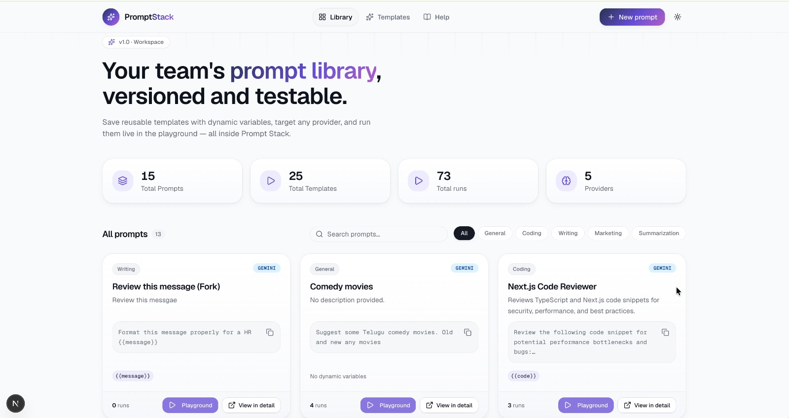

# PromptStack

PromptStack is a modern AI prompt library and playground built for developers, prompt engineers, content creators, and product teams. It gives you a centralized workspace to create, organize, test, and reuse prompts without switching between notes, chats, or scattered text files.

Instead of keeping prompts in random places, PromptStack helps you manage them like a real product: store templates, inject variables, choose model settings, run them live, and refine them quickly.

## Why use PromptStack?

PromptStack is useful when you want to:

- Keep all your prompt ideas and reusable templates in one place
- Build prompts faster with structured templates and placeholders
- Test prompts live with real AI providers before using them in production
- Reuse successful prompts across different projects and workflows
- Organize prompts by category, tags, and purpose
- Compare outputs from different providers and model configurations

## What PromptStack can do

PromptStack provides a complete workflow for prompt development:

- Create and save reusable prompt templates
- Use dynamic placeholders such as `{{topic}}`, `{{audience}}`, or `{{tone}}`
- Search and filter prompts by category, title, or keyword
- Run prompts directly in the browser using Gemini or Groq
- Add system instructions and model settings for each prompt
- Store prompts in MongoDB for fast reuse and iteration
- Test and refine prompts without switching between multiple tools
- Browse a curated template marketplace and fork templates into your library
- Track workspace-level stats such as prompt count, template count, runs, and provider usage

## Key features

- Prompt library dashboard with search, filtering, and live loading states
- Reusable prompt templates with dynamic variable support
- Interactive playground for executing prompts with user-provided values
- Template marketplace with featured templates and fork support
- Prompt detail pages with full template preview and integration snippets
- Workspace analytics for total prompts, templates, runs, and providers
- Responsive UI built with Next.js, Tailwind CSS, and shadcn/ui
- Theme toggle and polished modern interface
- MongoDB-backed persistence for prompts, templates, and stats

## Main application flows

- Home page: browse and manage your prompt library
- Templates page: explore public or curated prompt templates
- Help page: understand how to use PromptStack efficiently
- Prompt detail page: inspect prompt content, variables, and execution details
- Template detail page: view template metadata, usage stats, and code examples
- Playground page: execute prompts live with dynamic inputs

## Supported routes

- `/` — Prompt library dashboard
- `/templates` — Template marketplace
- `/help` — Documentation and usage guide
- `/:id/prompt` — Prompt detail page
- `/:id/template` — Template detail page
- `/:id/playground` — Live prompt playground

## Tech stack

PromptStack is built with a modern full-stack setup:

- Next.js 16
- React 19
- TypeScript
- Tailwind CSS
- shadcn/ui
- MongoDB + Mongoose
- Gemini API integration via `@google/genai`
- Groq API integration via `groq-sdk`
- Sonner for toast notifications

## Project structure

- `src/app/` — app routes, page components, and server actions
- `src/components/` — reusable UI components and dialogs
- `src/global/` — shared types, constants, and app-wide config
- `src/lib/` — database connection, parsers, helpers, and utilities
- `src/models/` — Mongoose schemas for prompts and templates
- `public/` — static assets and screenshots

## Getting started

### Prerequisites

Make sure you have:

- Node.js 20 or newer
- A MongoDB instance or MongoDB Atlas cluster
- A Gemini API key and/or a Groq API key

### Environment variables

Create a `.env.local` file in the project root and add:

```env
MONGODB_URI=your_mongodb_connection_string
GEMINI_API_KEY=your_gemini_api_key
GROQ_API_KEY=your_groq_api_key
```

### Install dependencies

```bash
npm install
```

### Run the app locally

```bash
npm run dev
```

Then open http://localhost:3000 in your browser.

## Available scripts

- `npm run dev` — start the development server
- `npm run build` — create a production build
- `npm run start` — run the production build locally
- `npm run lint` — run ESLint checks
- `npm run format` — format the project with Prettier

## UI preview



## Summary

PromptStack is a practical and polished solution for anyone who works with AI prompts regularly. It combines prompt storage, variable-based templating, live execution, provider support, and template sharing in one clean interface.
